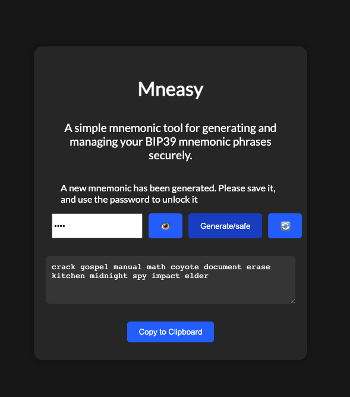

# Mneasy



> A simple mnemonic tool for generating and managing BIP39 mnemonic phrases securely.

## Features

- Generate BIP39 mnemonic phrases
- Encrypt and decrypt mnemonic phrases using a password
- Save encrypted mnemonics to local storage
- Copy mnemonics to the clipboard
- Clear and reload the page

## Installation

Clone the repository and install the dependencies:

```bash
git clone https://github.com/your-username/mneasy.git
cd mneasy
npm install
npx webpacl
```

Launching the tests...

```
npm test
```

## Usage

Open mnemonic.html in a web browser.

## License
This project is licensed under the MIT License.
